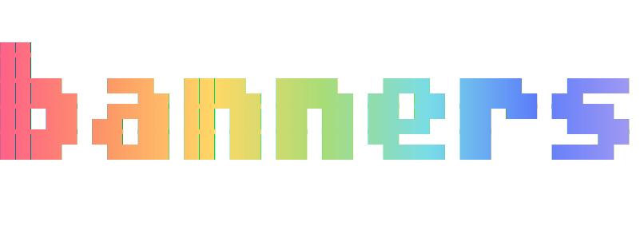

# Banner Images for Obsidian

          

<p align="center">
  
</p>

Display banner images at the top of your notes using frontmatter fields.

## Features

- **Frontmatter-driven** -- Add a single field to your note's frontmatter and a banner image appears at the top
- **Multiple image sources** -- Use vault-relative paths, wikilink-style paths (`[[image.png]]`), or external URLs
- **Customizable height** -- Set banner height globally or per-note via frontmatter
- **Opacity control** -- Adjust banner transparency globally or per-note
- **Vertical positioning** -- Control which part of the image is shown (top, center, bottom, or percentage)
- **Gradient transparency** -- Smooth fade from full opacity at the top to your chosen opacity at the bottom
- **Works in all views** -- Renders in both Reading View and Live Preview/Source mode
- **Mobile support** -- Full-width banners on mobile devices

## Installation

### From Obsidian Community Plugins

**Might not be submitted yet**

1. Open Obsidian Settings
2. Go to Community Plugins and disable Safe Mode
3. Click Browse and search for "Banner Images"
4. Install and enable the plugin

### Manual Installation

1. Download `main.js`, `manifest.json`, and `styles.css` from the [latest release](../../releases/latest)
2. Create a folder called `banner-images` inside your vault's `.obsidian/plugins/` directory
3. Copy the downloaded files into that folder
4. Enable the plugin in Obsidian Settings > Community Plugins

## Usage

### Quick Start

1. Enable the plugin in settings
2. Add `banner_image` to your note's frontmatter:

```yaml
---
banner_image: path/to/your/image.png
---
```

### Frontmatter Fields

| Field             | Type          | Default | Description                                                                       |
| ----------------- | ------------- | ------- | --------------------------------------------------------------------------------- |
| `banner_image`    | string        | --      | Path to image file (required). Also accepts `backdrop` or `banner` as field names |
| `banner_height`   | number        | 200     | Height of the banner in pixels                                                    |
| `banner_opacity`  | number        | 1       | Opacity from 0 (transparent) to 1 (fully visible)                                 |
| `banner_offset`   | string/number | center  | Vertical position: `top`, `center`, `bottom`, or a percentage like `20%`          |
| `banner_gradient` | boolean       | false   | When true, fades from full opacity at top to selected opacity at bottom           |

### Examples

**Basic banner:**

```yaml
---
banner_image: attachments/header.jpg
---
```

**Full customization:**

```yaml
---
banner_image: attachments/landscape.png
banner_height: 300
banner_opacity: 0.7
banner_offset: 30%
banner_gradient: true
---
```

**Using a URL:**

```yaml
---
banner_image: https://example.com/image.jpg
banner_height: 250
---
```

**Using wikilink syntax:**

```yaml
---
banner_image: "[[my-banner.png]]"
---
```

### Supported Image Formats

- Vault-relative paths: `attachments/banner.png`
- Wikilink-style paths: `[[image.png]]`
- External URLs: `https://example.com/image.png`
- All common image formats: PNG, JPG, GIF, WebP, SVG

## Settings

Access settings via Obsidian Settings > Banner Images:

- **Enable banner images** -- Master toggle for the feature
- **Default height** -- Default banner height in pixels (used when `banner_height` is not set in frontmatter)
- **Default opacity** -- Default transparency level (used when `banner_opacity` is not set)
- **Gradient transparency** -- Enable gradient fade by default
- **Default vertical position** -- Default image positioning (used when `banner_offset` is not set)

## Compatibility

This plugin uses the `banner_image` frontmatter key by default. For compatibility with other banner plugins, it also reads the `backdrop` and `banner` fields.

## License

This plugin is released under the [MIT License](LICENSE).
